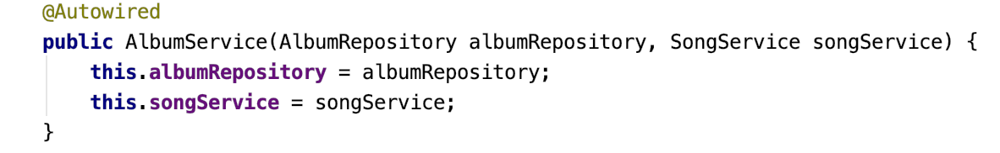
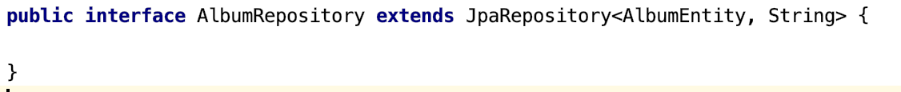

# Spring Boot and Flyway

This exercise uses the Spring Boot framework and if you are not
familiar with it, then this primer is for you. We also use Flyway for database
schema management. If you wish to change the database schema, you need to
understand it.

## Dependency injection

Spring gives you dependency injection with the annotation
`@AutoWired`. Example:

The dependencies are available as field variables. One of the advantages with this
approach is that it is easy to replace the dependencies with mocks. You can test
your class in isolation and all dependencies are just mocks. There doesn't have
to be any real implementation so you can try out an interface from the client
side without implementing the interface.

## Database mapping

Spring has a somewhat magic mapping of objects to relational data. You specify
an interface that extend `JpaRepository`. Spring will then create implementation
of that interface for you. 

Example:

As type parameters, the entity class and the type of the primary key is given.

A number of methods become immediately available, check what your IDE is telling
you. For instance, `findById`, finds an entity given its id. But you can also 
create your own by following the pattern, eg `findByName` will find all entities
with a given name, assuming that the entity has an attribute called "name".

This reveals you from writing queries for the trivial, common cases. 

## Flyway database schema management

In the directory `src/main/resources/db/migration`, you find the versions of the 
database schema. When the Spring Boot application starts, Flyway checks the 
database to see which version of the schema it has. If it is old, Flyway will 
apply the files in numerical order. 

This ensures that the code is in synchronized with the schema before the code
runs.

## Read more

Spring Boot: https://spring.io/projects/spring-boot

Flyway: https://flywaydb.org